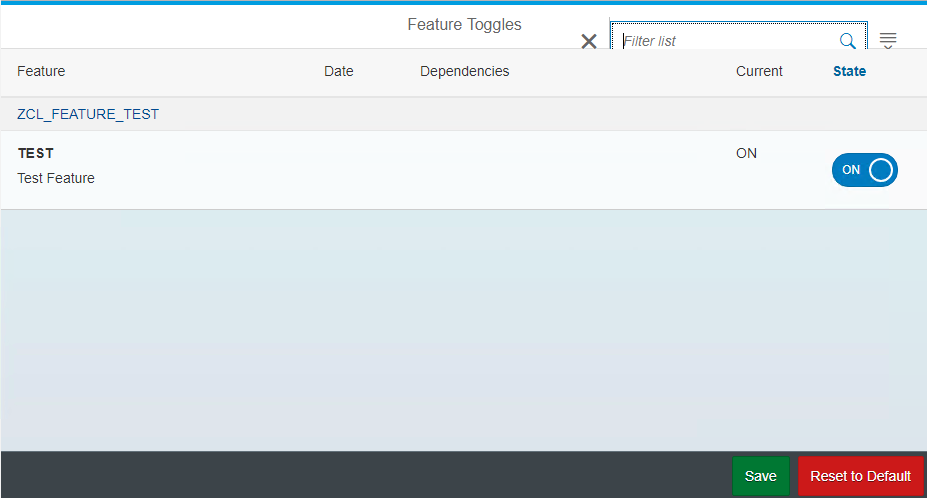

# Featuretoggle
A simple, lightweight feature toggle framework for ABAP

## What is it?
With this framework you can toggle features in ABAP-Code at runtime. This enables you to continuously deliver (potentially unfinished) Features in a deactivated state into the production system. This repository includes the ABAP backend and a UI5 GUI to manage toggle states.

## Requirements
* SAP 7.4
* [abapGit](https://github.com/larshp/abapGit)
* Eclipse + UI5/ADT Tools

## How to run it?
1. Create a new ABAP class which inherits the class `z_sy_feature` (see [examples/zcl_feature_test.abap](https://github.com/pacroy/Featuretoggle/blob/master/examples/zcl_feature_test.clas.abap)).
2. Define new feature via class attribute 
3. Toggle feature via the transaction `z_sy_feature` (which opens UI5 frontend)
4. Check if feature is enabled by checking e.g. `zcl_feature_test=>test = abap_true` 
5. Write authorization check in `z_sy_cl_featurelist_rest->check_write_auth`

:warning: Features should never be enabled in production system!

### Examples
see /examples

## Installation

### Install ABAP Backend

1. Checkout/clone subfolder /src/abap/ via [abapGit](https://github.com/larshp/abapGit)
2. Check transaction `SICF` if node `/default_host/sap/bc/sy_feature` was created
3. Activate node `/default_host/sap/bc/sy_feature`

### Installation UI5 Frontend 

1. Checkout/clone subfolder `/src/ui5/` 
2. Run program `/UI5/UI5_REPOSITORY_LOAD`
3. Name UI5 app `z_sy_feature` and click Execute
4. Select the folder `WebContent` in `/src/ui5`
5. Click green label to upload
